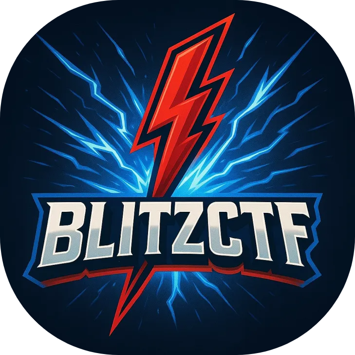

  

<h1 align="center">BlitzCTF 2025 – Archive</h1>

  <strong>📁 A static archive of the BlitzCTF 2025 event platform, built on CTFd</strong>

  
  
  
  
  

---

## 📌 Overview

This repository contains a **static archive** of the CTFd platform used during **BlitzCTF 2025**, held from **5th to 7th July 2025**. It preserves the **frontend structure** of the event for educational and reference purposes.

> **Note:** This archive does **not** include backend functionalities (e.g., flag submission, login, scoreboard updates).

---

## 📂 Contents

- Static HTML, CSS, and JS files generated from the CTFd export
- Challenge descriptions, downloadable files, and point values
- Scoreboard layout and custom UI from the live event

---

## ❌ Limitations

This archive is **read-only** and does not contain:
- Flag validation or scoring backend
- Login or user registration functionality
- Admin panel or dynamic features

---

## 🏆 Sponsors

### 🥇 Platinum

  

### 🥈 Silver

  
  

### 📜 Certificate Partner

  

We thank our sponsors for supporting cybersecurity education and competition!

---

## 📜 Certificates

- 🏅 **Top 10 global teams** received **Certificates of Achievement**
- 📜 All participants received **Certificates of Participation**
- 📦 **Physical goodies** shipped to Indian winners only

---

## 📅 Event Summary

- **Name**: BlitzCTF 2025  
- **Dates**: 5th – 7th July 2025  
- **Platform**: [CTFd](https://ctfd.io) (custom-themed)  
- **CTFtime**: [https://ctftime.org/event/2816](https://ctftime.org/event/2816)

---

## 🧠 Authors & Organizers

  

Organized with ❤️ by a team of passionate hackers.  
For contact or collaboration: 📧 [Mail Us](mailto:contact@blitzhack.xyz)

---

## 📬 Contact

- Open an issue for feedback or archive questions
- Connect with us via [Discord](https://discord.blitzhack.xyz) 

---

  ⚔️ Made with passion by the BlitzCTF Team • See you in 2026!

